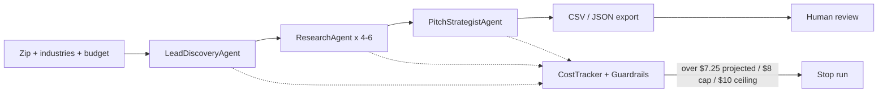

# NightForge LeadForge

A CrewAI + Streamlit pipeline that finds local trades businesses from public web data, researches them in parallel, and writes a reviewable CSV of outreach drafts. It is built for owner-led trades shops — HVAC, plumbing, electrical, roofing, general contractors, garage doors, pest control, auto repair — that are drowning in scheduling, invoicing, missed calls, and estimate follow-up. It does not send email, it does not scrape behind logins, and it will not run without a budget cap.

## Why I built it

I got tired of agent demos that wander until the bill shows up. NightForge is the opposite: discover local trades leads from public sources, research them in parallel, draft a specific outreach email, write a CSV, stop when the budget says stop. I use it for Barren Business Development. Every row still needs a human.

## What it does

1. **LeadDiscoveryAgent** searches public listings, reviews, job posts, and company sites for trades businesses near a zip code, plus remote-ready US leads. It returns a JSON array validated into `DiscoveredLead` objects.
2. **ResearchAgent**, running 1–8 workers in a thread pool (6 by default), builds a public-data dossier per lead: owner and contact signals, website capabilities, booking friction, review themes, recent public signals, pains, and Barren fit.
3. **PitchStrategistAgent** turns each dossier into a 300–500 word draft email with one CTA, a pitch angle, specific value props, and a recommended next step.
4. **Export** writes `data/output/leads_<run_id>.csv` and `.json`, a run manifest, and a token-usage log.

`CostTracker` and `Guardrails` run alongside all three phases. Cost is checked before every agent call and before every queued lead, so the run stops mid-pipeline instead of after the damage.



## Stack

CrewAI, LangChain, Streamlit, Pydantic v2. Search is Tavily first, Brave second, DuckDuckGo as the keyless fallback. Anthropic and xAI are optional LLM providers; Google Sheets is an optional export target. Python 3.10–3.12. Default model `gpt-4o-mini`.

## Guardrails

| Control | Value | Where |
| --- | --- | --- |
| Model | `gpt-4o-mini` | `config/settings.yaml` |
| Max leads | 30 | `guardrails.max_leads_processed` |
| Recommended budget cap | $8.00 | `guardrails.budget_usd` |
| Hard ceiling | $10.00 | clamped in `config_loader.py` and `run_context.py` |
| Early stop, projected | $7.25 | `guardrails.stop_projected_usd` |
| Parallel researchers | 6 (clamped 1–8) | `guardrails.max_parallel_research` |
| Human review | required, always `YES` | `guardrails.human_review_required` |
| Email sending | none, no send path exists | — |

Set `LEADFORGE_BUDGET_USD` above 10 and preflight fails with an error. Set it above 8 and you get a warning. The UI slider will not go past $10.

## Quick start

```bash
git clone https://github.com/DannyBarren/NightForge-LeadForge.git
cd NightForge-LeadForge
python3 -m venv .venv
source .venv/bin/activate
pip install -r requirements.txt
cp .env.example .env
streamlit run app.py
```

In the UI: **1. Setup** (paste `OPENAI_API_KEY`, and `TAVILY_API_KEY` if you have one) → **2. Configuration** (zip code, 30 leads, $8 cap, 6 workers) → **3. Run Pipeline** (preflight has to pass before the button enables) → **4. Results** (review rows, download CSV/JSON).

From the command line:

```bash
make demo      # dry-run key check, then a 3-lead sample run, then the CSV path and cost
make dry-run   # validate config, keys, and guardrails — no LLM calls, no spend
make sample    # 3-lead end-to-end run, parallel research capped at 4
make ui        # streamlit run app.py
make test      # pytest -q
```

Architecture: [docs/ARCHITECTURE.md](docs/ARCHITECTURE.md)

Live-call walkthrough: [docs/DEMO.md](docs/DEMO.md)

`make demo` runs `scripts/demo.sh`, which does three things: a dry-run that tells you exactly which key is missing and where to get it; a 3-lead sample run where seed leads and a deterministic fallback pitch cover for a flaky search API or LLM, so the demo does not dead-end; and a final block printing `DEMO READY`, the newest CSV path with its row count, and the estimated cost from the token log.

## Output

Every run writes four files to `data/output/`:

- `leads_<run_id>.csv`
- `leads_<run_id>.json`
- `manifest_<run_id>.json` — location, industries, counts per phase, estimated cost, stop reason
- `token_usage_<run_id>.json` — every agent call with input tokens, output tokens, dollars, and a running total

CSV columns, from `PitchOutput.to_export_row`:

`Company`, `Owner`, `Email`, `Phone`, `LinkedIn`, `Industry`, `Location`, `Lead Scope`, `Pains`, `Barren Fit`, `Draft Email`, `Pitch Angle`, `Specific Value Props`, `Recommended Next Step`, `Confidence`, `Human Review`, `Sources`

`data/output/sample_leads_output.csv` is a checked-in fake example so you can see the shape without spending anything.

## Optional: GitHub Actions overnight run

`.github/workflows/overnight-leads.yml` can run the pipeline on a nightly cron. **The schedule is commented out on purpose.** Every run of that workflow spends real API money against your own secrets — roughly $2–8 at the default cap. Enable it only if you want that: add `OPENAI_API_KEY` as a repository secret and uncomment the `schedule:` block. Until then it only runs on manual dispatch.

## Ethics

Public web data only. No login walls, no private databases. No outreach automation — the app has no code path that sends an email. Every export row carries `Human Review: YES`. The demo seeds in `leadforge/sample_data.py` (Summit Ridge Heating & Air, BlueLine Plumbing Co., Copperfield Electric LLC) are labeled demo seeds and use `example.com` addresses and 555 phone numbers.

## What this is evidence of

- A multi-agent CrewAI system with a real Streamlit UI, a CLI runner, and tests — not a notebook
- Per-call cost accounting with a thread-safe tracker and a hard stop that fires mid-run, before the next agent call
- A sample mode that still produces 3 complete leads when search or the LLM flakes, because a live demo cannot depend on a third-party API being up
- A structured export contract a human reviews before anything leaves the building

## License

MIT. See [LICENSE](LICENSE).
